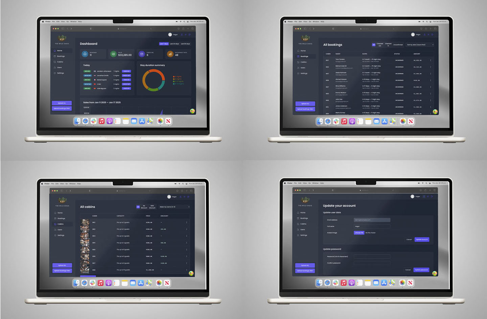

### **The Wild Oasis: Cabin Booking Dashboard**

## **Table of content:**

-   [Description](#description)
-   [Key Features](#key-features)
-   [Technologies Used](#technologies-used)
-   [Project Structure](#project-structure)
-   [Conclusion](#conclusion)

**Live demo** [click here](https://the-wild-oasis-vacations.netlify.app/)



### **Description:**

The Wild Oasis is a comprehensive **Cabin Booking Dashboard** designed to streamline the management of cabin bookings, guest information, and availability. Built with **React.js**, the application provides a seamless user experience for booking and managing cabins. This dashboard is feature-rich and aims to simplify operations for both staff and guests.

---

### **Key Features:**

1. **Booking Management:**

    - Add, edit, and delete bookings with detailed information.
    - Check guests in and out seamlessly.

2. **Cabin Management:**

    - Manage cabin details, including adding, editing, and deleting cabins.
    - Displays a clean layout with cabin images and descriptions.

3. **Guest Management:**

    - Store and retrieve guest information.
    - Includes forms for creating and editing guest details.

4. **Dashboard Insights:**

    - Real-time analytics for recent bookings, stays, and sales.
    - Interactive charts for tracking key metrics like duration of stay and revenue.

5. **Authentication and Security:**

    - Login, signup, and password update functionality.
    - User authentication using **Supabase**.

6. **Data Persistence:**

    - Uses **Supabase** for database operations and authentication.
    - Efficient state management with **TanStack Query**.

7. **Advanced Features:**
    - Dark mode toggle for improved user experience.
    - Priority flagging for urgent tasks.
    - Modular and reusable components for scalability.

---

### **Technologies Used:**

-   **React.js**: Front-end library for building the user interface.
-   **Supabase**: Backend-as-a-Service for database and authentication.
-   **TanStack Query**: Manages server state and optimizes data fetching.
-   **React Router**: Enables seamless navigation between pages.
-   **React Hook Form**: Simplifies form handling and validations.
-   **Recharts**: Renders interactive charts and graphs.
-   **CSS Modules**: For scoped, maintainable component styles.

---

### **Project Structure:**

```
- index.html                  # Entry point for the application
- public
- README.md
- src
  ├── App.jsx                # Main application component
  ├── context                # Global state management (Dark Mode)
  │   ├── DarkModeContext.jsx
  ├── data                   # Static data and utilities
  │   ├── cabins             # Cabin images
  │   ├── data-bookings.js   # Sample booking data
  │   ├── data-cabins.js     # Cabin information
  │   ├── data-guests.js     # Guest data
  │   ├── Uploader.jsx
  ├── features               # Core app functionalities
  │   ├── authentication     # User authentication and management
  │   ├── bookings           # Booking operations and views
  │   ├── cabins             # Cabin management features
  │   ├── check-in-out       # Guest check-in/out features
  │   ├── dashboard          # Dashboard insights and analytics
  │   ├── guests             # Guest data management
  │   ├── settings           # Application settings
  ├── hooks                  # Reusable custom hooks
  ├── main.jsx               # Application entry point
  ├── pages                  # Route-based pages
  ├── services               # API integrations
  ├── styles                 # Global styles and theming
  ├── ui                     # Reusable UI components
  ├── utils                  # Helper functions and constants
```

---

### **Conclusion:**

The Wild Oasis Cabin Booking Dashboard is an all-in-one solution for managing bookings, cabins, and guest data. Its use of modern web technologies like **React.js**, **Supabase**, and **TanStack Query** ensures a fast, responsive, and user-friendly interface. The dashboard is designed for scalability, making it an excellent choice for managing cabin reservations efficiently.

---
